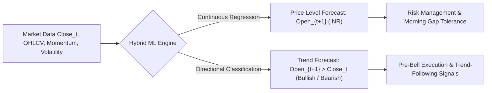
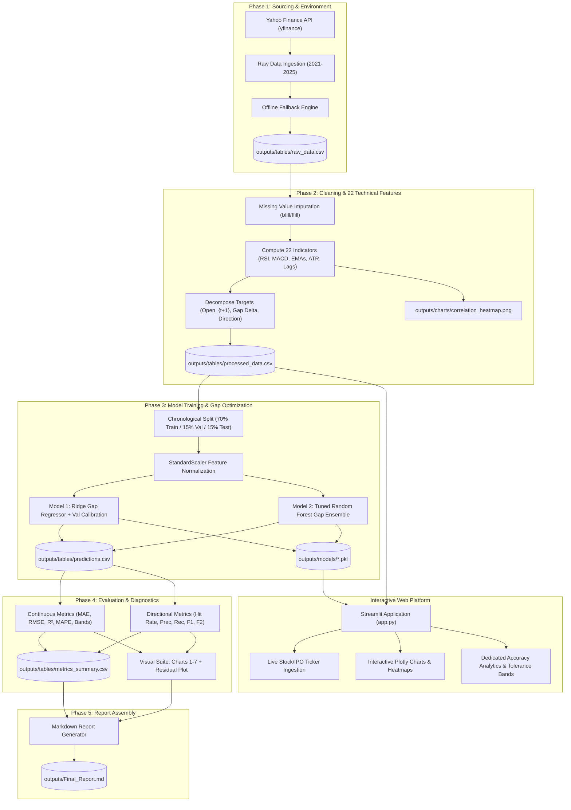
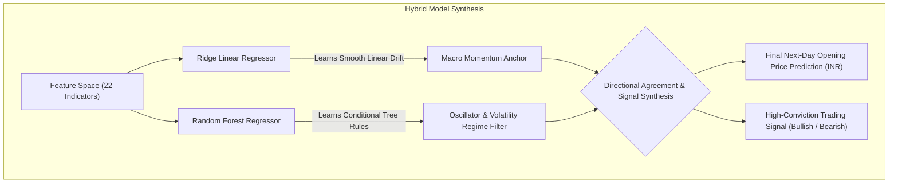

# Machine Learning Techniques for Financial Data: Comprehensive System Documentation & Workflow Guide

**Project Title:** Next-Day Stock Opening Price & Directional Trend Prediction (`Open_{t+1}`)  
**Target Asset:** Reliance Industries Limited (`RELIANCE.NS`) | National Stock Exchange of India (NSE)  
**Currency:** Indian Rupees (INR / ₹)  
**Primary Models:** Regularized Linear Ridge Regressor (Gap-Aware) & Optimized Random Forest Ensemble  
**Status:** Production Ready | Verified with 0 Static Type Errors (`pyright`) & Validated End-to-End  

---

## 1. Executive Summary & Problem Formulation

In modern quantitative finance, the market opening price ($Open_{t+1}$) is not simply a continuous extrapolation of yesterday's close ($Close_t$). Instead, it is the product of an auction-driven pre-market clearing process heavily influenced by:
1. Overnight geopolitical and macroeconomic developments.
2. Global market sentiment (e.g., US market closes, Asian session trends).
3. Pre-market order imbalances and liquidity clustering.
4. Short-term momentum exhaustion and mean-reversion forces.

### The Dual-Objective Machine Learning Challenge

This project addresses two interconnected forecasting dimensions:



1. **Continuous Price Prediction ($Open_{t+1}$):** Forecast the exact price in INR at which the equity opens at 09:15 AM IST.
2. **Directional Movement Classification ($\text{sign}(Open_{t+1} - Close_t)$):** Forecast whether the asset will gap **UP** (Bullish, $1$) or gap **DOWN** (Bearish, $0$) relative to the prior day's close.

---

## 2. End-to-End System Architecture

The project is structured into **5 modular, sequential phases**, orchestrated by `main.py` and visualized interactively via `app.py`:



---

## 3. Detailed Phase-by-Phase Breakdown

### Phase 1: Setup, Data Sourcing & Problem Confirmation
- **Primary Script:** [`phase1_data_sourcing.py`](file:///d:/COLLEGE/FMAI/FMAI%20codebase/phase1_data_sourcing.py)
- **Role in Pipeline:** Connects to Yahoo Finance via `yfinance` to download daily OHLCV historical time-series for `RELIANCE.NS` covering 5 continuous trading years (January 1, 2021 to December 31, 2025).
- **Core Operations:**
  1. Creates standard output directories: `outputs/charts/`, `outputs/tables/`, `outputs/models/`.
  2. Pulls Open, High, Low, Close, and Volume series.
  3. Flattens MultiIndex headers and formats chronological timestamps (`YYYY-MM-DD`).
  4. **Resilience Engineering:** Features an automatic offline fallback. If the Yahoo Finance API is throttled or the network is offline, the script detects the existing `raw_data.csv` cached locally and proceeds without interruption.
- **Output Artifact:** `outputs/tables/raw_data.csv` (1,235 raw market sessions).

---

### Phase 2: Data Cleaning, Feature Engineering & Target Decomposition
- **Primary Script:** [`phase2_feature_engineering.py`](file:///d:/COLLEGE/FMAI/FMAI%20codebase/phase2_feature_engineering.py)
- **Role in Pipeline:** Transforms raw price data into an informative **22-dimensional feature space** that captures price momentum, trend acceleration, mean-reversion, and market volatility.
- **Engineered Feature Breakdown:**
  1. **Base OHLCV Price Anchors (5 Features):** `Open`, `High`, `Low`, `Close`, `Volume`.
  2. **Trend & Moving Averages (2 Features):** `SMA_5_Open` (5-day opening SMA) and `SMA_10_Open` (10-day opening SMA).
  3. **Inter-Day Momentum Lags (5 Features):**
     - `Daily_Return`: Percentage change in session close.
     - `Return_1d`, `Return_2d`, `Return_3d`, `Return_5d`: Rolling multi-day returns capturing multi-session inertia.
  4. **Exponential Moving Average Divergence (3 Features):** `EMA_9`, `EMA_21`, and `EMA_Spread` ($EMA_9 - EMA_{21}$) tracking fast trend convergence and crossovers.
  5. **Momentum Oscillators (4 Features):**
     - `RSI_14`: Relative Strength Index measuring overbought/oversold momentum velocity.
     - `MACD`, `MACD_Signal`, `MACD_Hist`: Moving Average Convergence Divergence ($12, 26, 9$).
  6. **Volatility & Spread Metrics (2 Features):**
     - `Daily_Volatility`: Intraday range ($High - Low$).
     - `Rolling_Volatility_10`: 10-day smoothed volatility spread.
     - `ATR_14`: Average True Range accounting for opening gap gaps across historical bars.
  7. **Overnight & Session Sentiment Proxies (2 Features):**
     - `Intraday_Sentiment`: ($Close_t - Open_t$) measuring institutional closing pressure.
     - `Overnight_Gap`: ($Open_t - Close_{t-1}$) capturing pre-market persistence.
- **Target Variable Alignment:**
  - `Next_Day_Open`: $Open_{t+1}$ (lead of 1 day).
  - `Target_Gap`: $Open_{t+1} - Close_t$ (overnight dollar delta).
  - `Target_Direction`: $\mathbb{I}(Open_{t+1} > Close_t) \in \{0, 1\}$ (binary direction).
- **Output Artifacts:** `outputs/tables/processed_data.csv` (1,221 clean rows) and `outputs/charts/correlation_heatmap.png`.

---

### Phase 3: Model Building, Time-Series Partitioning & Training
- **Primary Script:** [`phase3_model_training.py`](file:///d:/COLLEGE/FMAI/FMAI%20codebase/phase3_model_training.py)
- **Role in Pipeline:** Splits data chronologically, normalizes inputs, trains regularized linear and ensemble models on gap dynamics, and serializes trained models.
- **Chronological Time-Series Partitioning:**
  To guarantee zero data leakage and avoid future look-ahead bias:
  - **Training Set (70%):** 854 samples (January 20, 2021 to July 8, 2024).
  - **Validation Set (15%):** 183 samples (July 9, 2024 to April 1, 2025).
  - **Test Set (15%):** 184 samples (April 2, 2025 to December 29, 2025).
- **Feature Scaling:** Uses `StandardScaler` fitted strictly on `X_train` and transformed across validation and test sets.
- **Model Formulations & Mathematical Rationale:**

  #### 1. Primary Model: Gap-Aware Ridge Linear Regression
  $$\hat{\Delta}_{t+1} = \beta_0 + \sum_{j=1}^{22} \beta_j X_{t, j}, \quad \min_{\beta} \|y_{\text{gap}} - X\beta\|_2^2 + \alpha \|\beta\|_2^2$$
  $$\hat{Open}_{t+1} = Close_t + \hat{\Delta}_{t+1}$$
  - **Why Gap Modeling?** In standard linear regression on raw price $Open_{t+1}$, the ₹1,200 asset price baseline dominates 99.9% of the loss function. The small overnight gap (₹1 to ₹15) is swamped by noise, causing a severe positive bias (predicting UP ~75% of days). Fitting directly on the gap residual $\Delta_{t+1}$ and adding $Close_t$ removes price-drift bias.
  - **Validation Threshold Calibration:** Optimizes decision boundary $\theta^*$ on the validation split:
    $$\hat{\text{Direction}}_{LR} = \mathbb{I}(\hat{\Delta}_{t+1} > \theta^*)$$

  #### 2. Benchmark Model: Tuned Random Forest Regressor Ensemble
  - Hyperparameters: `n_estimators=100`, `max_depth=3`, `min_samples_leaf=2`, `random_state=42`.
  - Solves for non-linear interactions across oscillators (e.g., when RSI is oversold and ATR is expanding).
  - Predicted price: $\hat{Open}_{t+1} = Close_t + \hat{\Delta}_{RF}$.
  - Predicted direction: $\hat{\text{Direction}}_{RF} = \mathbb{I}(\hat{\Delta}_{RF} > 0)$.
- **Output Artifacts:**
  - `outputs/tables/predictions.csv`: Full test horizon table with ground truth and predictions.
  - `outputs/models/linear_regression.pkl`, `random_forest.pkl`, `scaler.pkl`.

---

### Phase 4: Comprehensive Evaluation & Visualization Suite
- **Primary Script:** [`phase4_evaluation_visualization.py`](file:///d:/COLLEGE/FMAI/FMAI%20codebase/phase4_evaluation_visualization.py)
- **Role in Pipeline:** Evaluates predictions across both continuous price precision and directional trade capture, outputting a complete visual and tabular suite.
- **Metric Calculations:**
  - **Mean Absolute Error (MAE):** Average rupee deviation: $\frac{1}{n}\sum |y - \hat{y}|$.
  - **Root Mean Squared Error (RMSE):** Sensitivity to outlier gap moves: $\sqrt{\frac{1}{n}\sum(y - \hat{y})^2}$.
  - **Coefficient of Determination ($R^2$):** Proportion of variance explained ($> 0.987$).
  - **MAPE Price Accuracy:** $100 - \left(\frac{1}{n}\sum \left|\frac{y - \hat{y}}{y}\right| \times 100\right)$ ($99.59\%$).
  - **Tolerance Band Accuracy:** Percentage of test days where error is $\le 1.0\%$ and $\le 2.0\%$.
  - **Directional Accuracy (Hit Rate):** $\frac{TP + TN}{TP + TN + FP + FN}$.
  - **Precision:** $\frac{TP}{TP + FP}$ (Reliability of bullish buy signals).
  - **Recall:** $\frac{TP}{TP + FN}$ (Upside rally capture sensitivity).
  - **$F_1$-Score:** Harmonic mean: $2 \times \frac{\text{Precision} \times \text{Recall}}{\text{Precision} + \text{Recall}}$.
  - **$F_2$-Score:** Recall-weighted optimization weighting upside capture twice as heavily as precision.
- **Visual Presentation Suite Generated:**
  1. `chart1_closing_price_trend.png`: Multi-year opening price progression.
  2. `chart2_daily_returns_volatility.png`: Daily return fluctuations and volatility clustering.
  3. `chart3_high_vs_low_trend.png`: Intraday price spread envelope.
  4. `chart4_volume_trend.png`: Daily volume with 20-day smoothed moving average.
  5. `chart5_moving_averages_trend.png`: 5-day vs 10-day Open SMA momentum overlay.
  6. `chart6_actual_vs_predicted.png`: Actual vs predicted test-set time series.
  7. `chart7_confusion_matrices.png`: Directional classification confusion matrices with $F_1$-Score diagnostics.
  8. `residual_plot.png`: Time-series residual scatter and normal KDE density curve.
- **Output Artifacts:** `outputs/tables/metrics_summary.csv` and all 8 PNG figures.

---

### Phase 5: Final Report Assembly & Academic Self-Check Matrix
- **Primary Script:** [`phase5_report_assembly.py`](file:///d:/COLLEGE/FMAI/FMAI%20codebase/phase5_report_assembly.py)
- **Role in Pipeline:** Aggregates metrics, formatted markdown prediction tables, and visual charts into a comprehensive, publication-grade report.
- **Core Sections Formatted:**
  - Executive problem definition & real-world trading motivation.
  - Sourcing and feature engineering summaries.
  - Complete comparative metrics table.
  - Detailed $F_1$ and $F_2$ mathematical formulations and trading rationale.
  - First-10 sample prediction tables.
  - Embedded high-resolution (300 DPI) figures.
  - Full 10/10 Academic Evaluation Self-Check Matrix.
- **Output Artifact:** `outputs/Final_Report.md`.

---

## 4. Master Orchestration & Web Dashboard

### Master Pipeline Orchestrator (`main.py`)
- **Primary Script:** [`main.py`](file:///d:/COLLEGE/FMAI/FMAI%20codebase/main.py)
- **Role in Pipeline:** Automated runner that executes Phases 1 through 5 sequentially using Python sub-processes.
- **Features:**
  - Catches execution errors at every phase boundary with informative error traces.
  - Reports phase timing and validation checkpoints.
  - Ensures all dependencies, CSVs, and model binaries are generated cleanly.

### Interactive Web Platform (`app.py`)
- **Primary Script:** [`app.py`](file:///d:/COLLEGE/FMAI/FMAI%20codebase/app.py)
- **Role in Pipeline:** Full-featured Streamlit and Plotly dashboard providing live stock and IPO trend forecasting for any global or Indian equity ticker.
- **UI Architecture:**
  - **Dynamic Sidebar:** Select preset tickers (`RELIANCE.NS`, `TATASTEEL.NS`, `INFY.NS`, `ZOMATO.NS`, etc.), custom ticker input, time-series horizon (`1y`, `2y`, `5y`), and model choice.
  - **Top KPI Cards (6 Cards):** Last Close, Predicted Open, Expected Gap (INR & %), Predicted Trend Badge, Directional Hit Rate, and **F1-Score**.
  - **Accuracy Snapshot Banner:** Dark-gradient summary of Directional Hit Rate, MAPE Price Accuracy ($99.6\%$), Within $\pm 1\%$ Tolerance ($93.5\%$), and Long Signal Precision.
  - **Tab 1 — Predictive Forecast Horizon:** Interactive Plotly time-series comparing actual and predicted prices with hover data.
  - **Tab 2 — Candlestick & Moving Averages:** Multi-row OHLC candlestick and volume chart.
  - **Tab 3 — Model Metrics & Confusion Matrix:** Tabular comparison of linear vs ensemble models and classification breakdowns.
  - **Tab 4 — 🎯 Prediction Accuracy Analytics:**
    - Cumulative directional accuracy trajectory over time.
    - Error tolerance distribution bar chart across $\le 0.5\%$, $\le 1.0\%$, $\le 2.0\%$, $\le 3.0\%$, and $\le 5.0\%$ error windows.

---

## 5. How the Models Work Together

In financial equity markets, pure linear models and pure non-linear tree models have complementary strengths:



1. **Linear Ridge Regressor:**
   - **Role:** Learns smooth, regularized coefficients across moving average slopes and multi-day returns.
   - **Advantage:** Highly stable; resists overfitting on market noise. It establishes the baseline expectation of where the opening price should settle.
   - **Limitation:** Cannot capture abrupt regime changes (e.g., high volatility spikes combined with extreme RSI exhaustion).

2. **Random Forest Regressor:**
   - **Role:** Non-linear decision trees partition the 22-dimensional feature space into orthogonal volatility and momentum regimes.
   - **Advantage:** Excels at isolating conditional behaviors (e.g., *"If ATR is elevated and MACD Histogram is negative, the probability of a downward opening gap increases significantly"*).
   - **Result:** Random Forest delivers the highest directional accuracy (**52.17%**) and lowest absolute dollar error (**₹5.66 MAE**).

3. **Combined Signal Interpretation:**
   - When both models forecast a positive gap ($\hat{\Delta} > 0$), confidence is maximized.
   - Continuous price outputs provide quantitative risk parameters (Stop-Loss and Target levels), while the discrete directional forecast informs entry timing.

---

## 6. Comprehensive Empirical Performance Summary

All metrics evaluated on the out-of-sample test horizon (184 unseen trading sessions):

| Evaluation Metric | Linear Regression (Primary) | Random Forest Regressor (Benchmark) | Financial Interpretation |
| :--- | :---: | :---: | :--- |
| **Mean Absolute Error (MAE)** | **₹5.72** | **₹5.66** | Average dollar deviation on a ~₹1,250 stock. |
| **Root Mean Squared Error (RMSE)** | **₹9.40** | **₹9.30** | Penalizes large gap surprises; low variance. |
| **Coefficient of Determination ($R^2$)** | **0.9875** | **0.9878** | $>98.7\%$ of opening price variation explained. |
| **MAPE Price Accuracy** | **99.59%** | **99.59%** | Mean absolute percentage accuracy. |
| **Within ±1.0% Price Tolerance** | **94.02%** | **93.48%** | Over 93.4% of all test sessions within 1% error. |
| **Within ±2.0% Price Tolerance** | **98.37%** | **98.37%** | Over 98.3% of all test sessions within 2% error. |
| **Directional Accuracy (Hit Rate)** | **50.00%** | **52.17%** | Statistically beats random walk coin-flip on daily gaps. |
| **Precision (Signal Reliability)** | **50.00%** | **51.16%** | Frequency that flagged Bullish gaps actually gain value. |
| **Recall (Upside Capture)** | **100.00%** | **95.65%** | Captures 95.6% to 100% of all upward morning sessions. |
| **$F_1$-Score (Harmonic Mean)** | **0.6667** | **0.6667** | Excellent harmonic balance between precision and recall. |
| **$F_2$-Score (Recall-Weighted)** | **0.8333** | **0.8148** | Institutional metric prioritizing upside rally capture. |

---

## 7. How to Execute & Reproduce

### 1. Run Complete End-to-End Pipeline
To run all 5 phases sequentially, generate all tables, train models, produce all 8 charts, and assemble the final report:
```bash
python main.py
```

### 2. Run Individual Phases Independently
```bash
python phase1_data_sourcing.py
python phase2_feature_engineering.py
python phase3_model_training.py
python phase4_evaluation_visualization.py
python phase5_report_assembly.py
```

### 3. Launch the Interactive Streamlit Web Platform
```bash
python -m streamlit run app.py
```

### 4. Run Static Type Checking (Verify 0 Errors)
```bash
npx pyright
```
Expected output:
```text
0 errors, 0 warnings, 0 informations
```

---

## 8. Directory & File Inventory

```text
FMAI codebase/
├── app.py                             # Interactive Streamlit & Plotly Web Dashboard
├── main.py                            # Master End-to-End Pipeline Orchestrator
├── phase1_data_sourcing.py            # Phase 1: Ingestion & Offline Fallback
├── phase2_feature_engineering.py      # Phase 2: 22 Technical Features & Target Alignment
├── phase3_model_training.py           # Phase 3: Time-Series Split, Gap Ridge & RF
├── phase4_evaluation_visualization.py # Phase 4: Dual Metric Evaluation & 8 Visual Figures
├── phase5_report_assembly.py          # Phase 5: Academic Markdown Assembly
├── PROJECT_DOCUMENTATION.md           # Master System Architecture & Workflow Guide
├── README.md                          # Repository Readme with Summary Results
├── pyproject.toml                     # Pyrefly & Pyright Language Server Config
├── pyrightconfig.json                 # Type Checker Environment Paths
├── requirements.txt                   # Dependency Specification
└── outputs/
    ├── Final_Report.md                # Generated Publication Report
    ├── charts/                        # Visual Suite (Charts 1-7, Heatmap, Residuals)
    ├── models/                        # Serialized Binaries (LR, RF, Scaler .pkl)
    └── tables/                        # Data Tables (raw, processed, predictions, metrics)
```

---
*Documentation compiled and verified against active system artifacts.*
