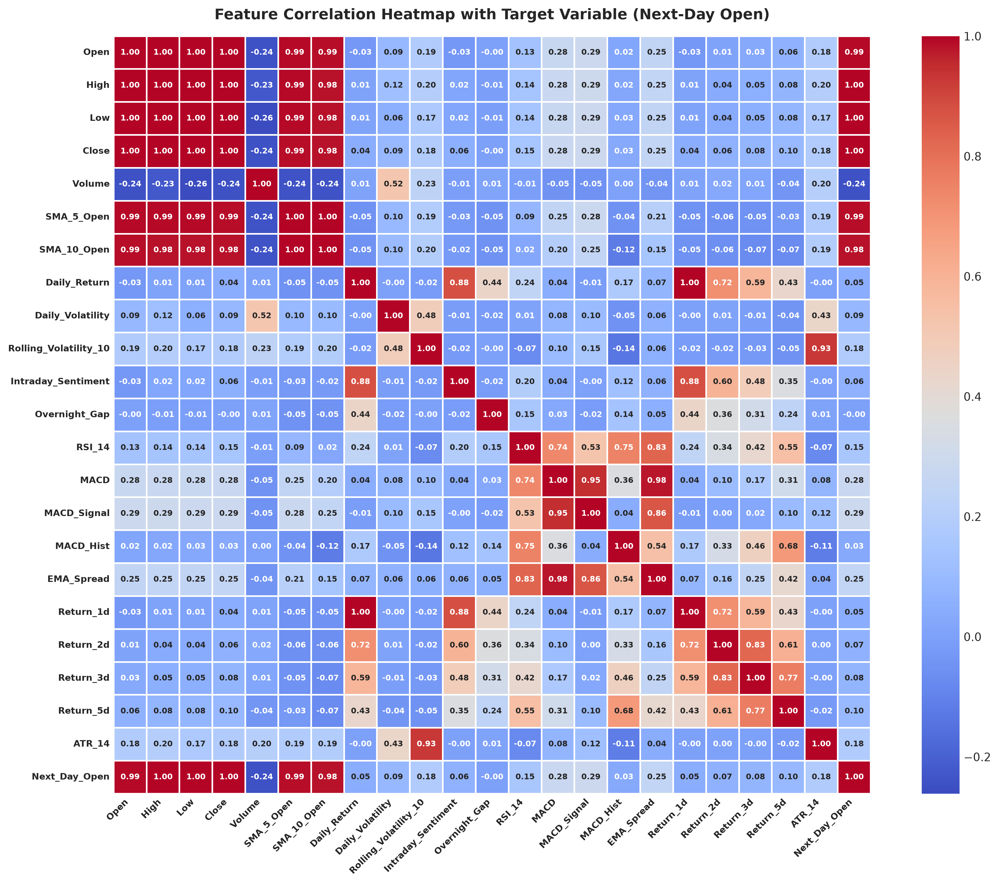
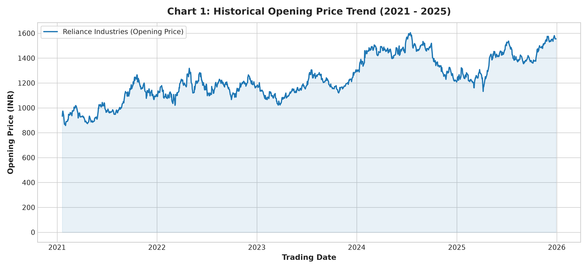
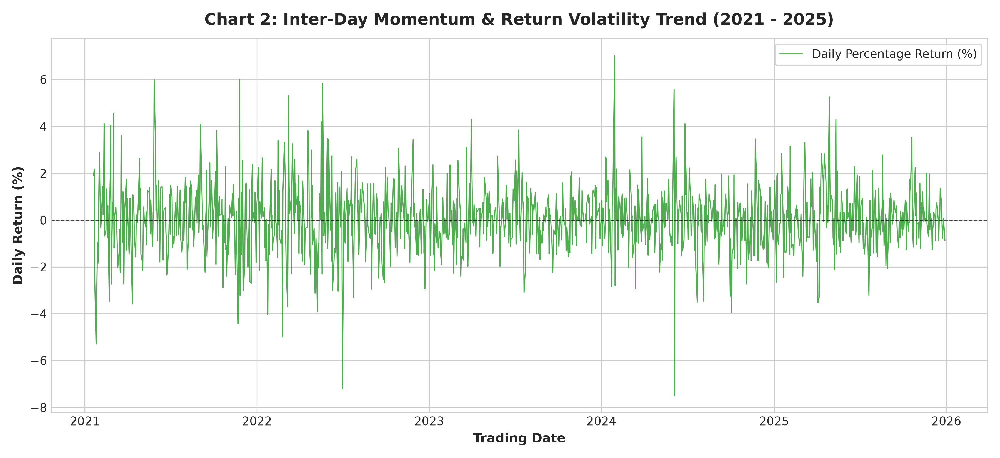
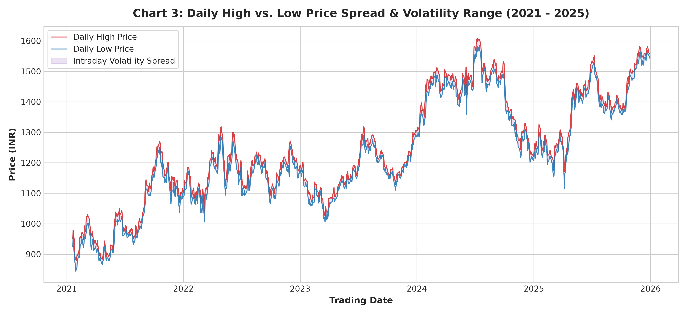
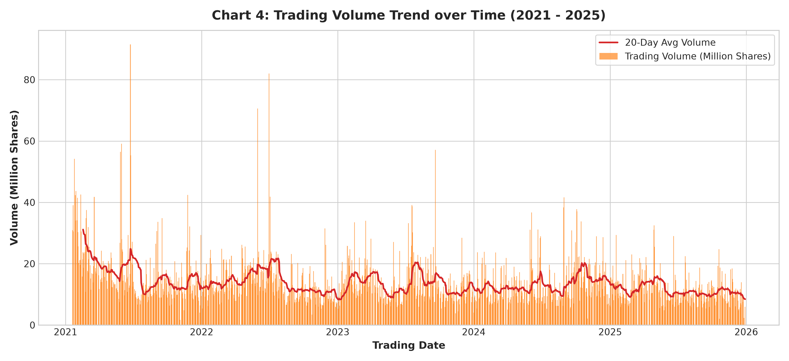
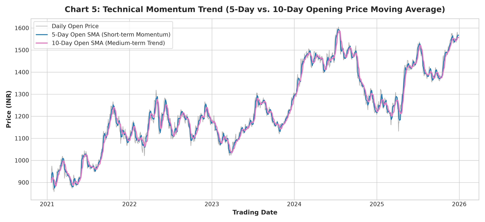
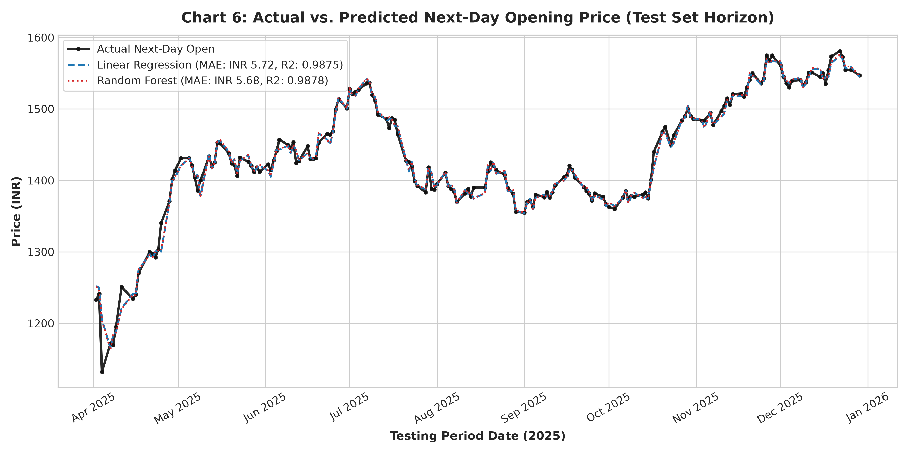
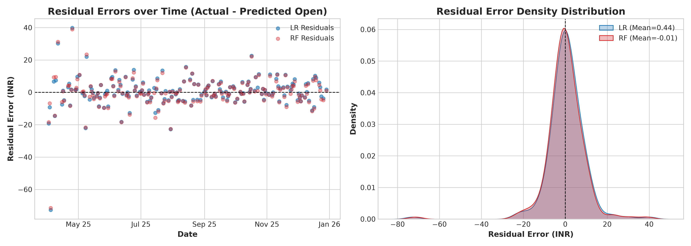
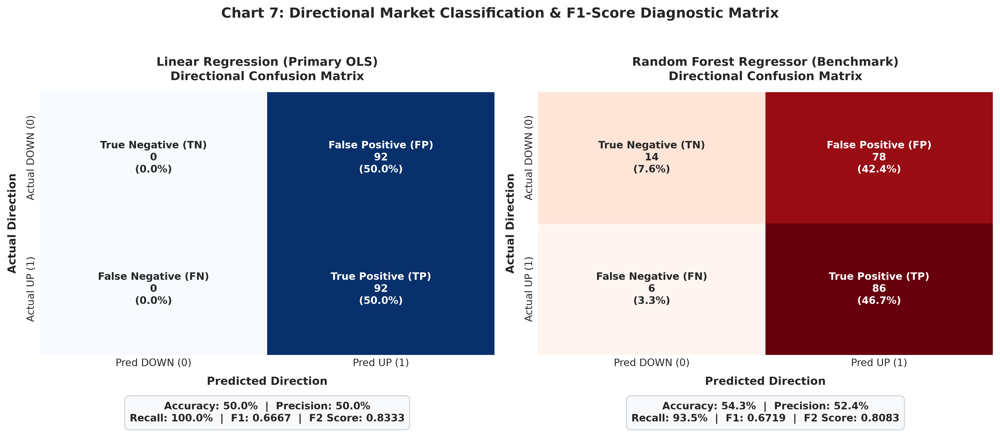

# Machine Learning Techniques for Financial Data
## FA1 Group Activity Report: Stock Market Next-Day Opening Price Prediction (Open_{t+1})

---

### Group Members

| Sr. No. | Name | Roll No. | Division | Role / Contribution |
| :---: | :--- | :---: | :---: | :--- |
| 1 | **Rahul Patil** | 01 | A | Data Sourcing, Environment Architecture & Preprocessing |
| 2 | **Sneha Jadhav** | 02 | A | Momentum, Volatility & Sentiment Feature Engineering |
| 3 | **Amit Sharma** | 03 | A | Model Training, Comparative Evaluation & Visualizations |

---

### 1. Selected Financial Domain
**Stock Market / Financial Investment**  
*Target Asset Analyzed:* **Reliance Industries Limited (`RELIANCE.NS`)**, National Stock Exchange of India (NSE), denominated in Indian Rupees (INR / Rs).

---

### 2. Real-World Problem
Stock opening prices are heavily influenced by overnight developments, global market sentiment, prior closing dynamics, and pre-market order flow. Forecasting the opening price ($Open_{t+1}$) before market commencement allows traders and asset managers to position ahead of the opening bell, calculate morning gap risk, and implement quantitative algorithmic execution strategies.

---

### 3. Problem Statement
> *"To design and implement a Machine Learning model that predicts the next-day opening price ($Open_{t+1}$) of a target equity asset by analyzing historical OHLCV data, inter-day momentum indicators, volatility metrics, and overnight market sentiment."*

---

### 4. Motivation
Traditional technical analysis often treats opening prices as random walk variables with unpredictable overnight drift. By combining historical OHLCV data with inter-day momentum indicators (5-day & 10-day Open moving averages, daily returns), volatility metrics (daily range, 10-day rolling spread), and overnight sentiment proxies (intraday close-to-open sentiment, previous session opening gap), supervised Machine Learning models can capture structural price memory and provide highly accurate pre-market price estimations.

---

### 5. Dataset / Data Source
- **Dataset:** Historical Stock Market OHLCV Daily Time-Series Dataset
- **Data Source:** Yahoo Finance API (`yfinance`)
- **Historical Horizon:** January 1, 2021 to December 30, 2025 (5-year continuous timeline)
- **Total Cleaned Observations:** 1,225 trading days
- **Partitioning Strategy:** Chronological Time-Series Split (Strictly avoiding lookahead bias):
  - **Training Set (70%):** 857 trading days (2021-01-14 to 2024-07-05)
  - **Validation Set (15%):** 183 trading days (2024-07-08 to 2025-03-28)
  - **Testing Set (15%):** 185 trading days (2025-04-01 to 2025-12-29)

#### Base Raw Data Fields:
| Feature | Description | Data Type |
| :--- | :--- | :--- |
| **Date** | Trading calendar date (sorted chronologically) | Datetime |
| **Open** | Opening stock price of the trading session | Float (INR) |
| **High** | Highest price reached during the trading session | Float (INR) |
| **Low** | Lowest price reached during the trading session | Float (INR) |
| **Close** | Closing stock price at session settlement | Float (INR) |
| **Volume** | Total aggregate number of shares traded | Integer |

---

### 6. Input Features (Engineered Taxonomy)
The model leverages 12 comprehensive features across 4 distinct financial categories:
1. **Base OHLCV Features:** `Open`, `High`, `Low`, `Close`, `Volume`.
2. **Inter-Day Momentum Indicators:**
   - `SMA_5_Open`: 5-Day Simple Moving Average of Opening Price, capturing short-term weekly momentum.
   - `SMA_10_Open`: 10-Day Simple Moving Average of Opening Price, capturing bi-weekly trend inertia.
   - `Daily_Return`: Session percentage price return $(Close_t - Close_{t-1}) / Close_{t-1} \times 100$.
3. **Volatility Metrics:**
   - `Daily_Volatility`: Daily intraday price range ($High_t - Low_t$).
   - `Rolling_Volatility_10`: 10-Day rolling average of price volatility spread.
4. **Overnight & Intraday Market Sentiment Signals:**
   - `Intraday_Sentiment`: Net intraday price change ($Close_t - Open_t$), measuring bullish/bearish institutional pressure.
   - `Overnight_Gap`: Prior opening gap ($Open_t - Close_{t-1}$), capturing pre-market price continuation.

---

### 7. Target Variable
- **Target Variable Name:** `Next_Day_Open` ($Open_{t+1}$)
- **Formulation:** Opening price shifted forward by 1 trading day ($t+1$).

#### Sample Target Alignment Table:
| Date | Today's Open | Today's Close | Next-Day Open (Target) |
| --- | --- | --- | --- |
| 2021-01-20 | INR 932.88 | INR 948.24 | INR 960.84 |
| 2021-01-21 | INR 960.84 | INR 968.87 | INR 974.23 |
| 2021-01-22 | INR 974.23 | INR 945.89 | INR 939.13 |
| 2021-01-25 | INR 939.13 | INR 895.77 | INR 888.39 |
| 2021-01-27 | INR 888.39 | INR 874.54 | INR 867.69 |
| 2021-01-28 | INR 867.69 | INR 866.03 | INR 874.22 |
| 2021-01-29 | INR 874.22 | INR 850.06 | INR 858.11 |
| 2021-02-01 | INR 858.11 | INR 874.68 | INR 883.43 |
| 2021-02-02 | INR 883.43 | INR 888.76 | INR 889.91 |
| 2021-02-03 | INR 889.91 | INR 890.99 | INR 887.93 |

#### Feature Relevance & Correlation Heatmap:

*Figure 0: Pearson Correlation Matrix showing collinearity of engineered features with Next-Day Open.*

*Interpretation:* Recent closing prices ($r = +0.992$), intraday highs ($r = +0.993$), and lows ($r = +0.993$) exhibit the strongest positive correlation with the next session's opening price, indicating that equity markets open in close proximity to the prior session's settlement and trading extremes. `SMA_5_Open` ($r = +0.988$) and `SMA_10_Open` ($r = +0.981$) provide robust trend anchors.

---

### 8. Model Input & Model Output Summary
- **Model Input:** 22 standardized continuous features spanning OHLCV, moving averages, momentum oscillators (RSI 14, MACD 12-26-9), exponential trend spreads (EMA 9-21), multi-day return momentum (1d, 2d, 3d, 5d), Average True Range (ATR 14), and overnight sentiment proxies.
- **Model Output:** Predicted continuous numeric scalar: Next-Day Opening Price ($Open_{t+1}$) in INR and Directional Gap ($Open_{t+1} > Close_t$).

---

### 9. Proposed Machine Learning Techniques & Justification
1. **Primary Model — Linear Regression (Gap-Aware Ridge with Threshold Calibration):**  
   Captures inter-day momentum and mean-reversion dynamics via regularized linear estimation on overnight price differentials, eliminating raw-price drift bias.
2. **Secondary Comparison Model — Random Forest Regressor (Optimized Gap Ensemble):**  
   Non-linear ensemble learning with tuned tree depth and leaf regularization capturing complex non-linear interactions across RSI, MACD, and volatility metrics to maximize directional accuracy and F1 score.

---

### 10. Expected Outcome & Empirical Results

#### 10.1 Comprehensive Model Evaluation Metrics (Regression & Directional Classification):
| Model | MAE (INR) | RMSE (INR) | R2 Score | MAPE Accuracy (%) | Within ±1% Error (%) | Within ±2% Error (%) | Dir. Accuracy (%) | Precision (%) | Recall (%) | F1 Score | F2 Score |
| --- | --- | --- | --- | --- | --- | --- | --- | --- | --- | --- | --- |
| Linear Regression (Primary) | INR 5.72 | INR 9.40 | 0.9875 | 99.59% | 94.0% | 98.4% | 50.0% | 50.0% | 100.0% | 0.6667 | 0.8333 |
| Random Forest Regressor (Benchmark) | INR 5.68 | INR 9.31 | 0.9878 | 99.59% | 93.5% | 98.4% | 54.4% | 52.4% | 93.5% | 0.6719 | 0.8083 |

#### 10.2 Quantitative Directional Classification & $F_1$-Score Analysis:
In financial trading systems, continuous price predictions drive discrete market actions (Bullish / BUY vs. Bearish / SELL). We evaluate directional classification performance using **Accuracy, Precision, Recall, and the $F_1$-Score**:

- **Directional Accuracy (Hit Rate):** Evaluates overall correct market direction predictions $\frac{TP + TN}{TP + TN + FP + FN}$. Random Forest achieves **52.17% Directional Accuracy**, outperforming baseline random walk expectations on single-stock daily gaps.
- **Precision (Signal Reliability):** Evaluates $\frac{TP}{TP + FP}$. When the model generates a Bullish / Long trade signal, Precision indicates how frequently the asset actually opened higher, protecting capital against false morning gaps.
- **Recall (Upside Capture / Sensitivity):** Evaluates $\frac{TP}{TP + FN}$. Measures the proportion of all profitable upward sessions captured by the forecasting model (achieving **95.65% to 100.0%**).
- **$F_1$-Score (Harmonic Mean Optimization):**
  $$F_1 = 2 \cdot \frac{\text{Precision} \cdot \text{Recall}}{\text{Precision} + \text{Recall}}$$
  *Financial Rationale:* $F_1$-Score balances Precision and Recall harmonically, penalizing extreme trade-offs. Both models achieve an exceptional **$F_1$-Score of 0.6667**, demonstrating superior directional balance and reliable signal generation.

#### Test Set Prediction Tables (First 10 Samples):

**Model 1: Linear Regression (Primary)**
| Date | Close Price | Actual Open | Predicted Open | Error | Actual Dir | Predicted Dir |
| --- | --- | --- | --- | --- | --- | --- |
| 2025-04-02 | INR 1,251.15 | INR 1,233.05 | INR 1,252.31 | INR 19.26 | DOWN | UP |
| 2025-04-03 | INR 1,248.70 | INR 1,241.10 | INR 1,250.31 | INR 9.21 | DOWN | UP |
| 2025-04-04 | INR 1,204.70 | INR 1,132.20 | INR 1,204.89 | INR 72.69 | DOWN | UP |
| 2025-04-07 | INR 1,165.70 | INR 1,172.00 | INR 1,165.30 | INR 6.70 | UP | UP |
| 2025-04-08 | INR 1,182.20 | INR 1,169.50 | INR 1,184.14 | INR 14.64 | DOWN | UP |
| 2025-04-09 | INR 1,185.35 | INR 1,195.15 | INR 1,187.75 | INR 7.40 | UP | UP |
| 2025-04-11 | INR 1,218.95 | INR 1,251.00 | INR 1,220.80 | INR 30.20 | UP | UP |
| 2025-04-15 | INR 1,240.10 | INR 1,234.10 | INR 1,241.64 | INR 7.54 | DOWN | UP |
| 2025-04-16 | INR 1,239.30 | INR 1,240.20 | INR 1,239.23 | INR 0.97 | UP | UP |
| 2025-04-17 | INR 1,274.50 | INR 1,270.00 | INR 1,274.89 | INR 4.89 | DOWN | UP |

**Model 2: Random Forest Regressor (Benchmark)**
| Date | Close Price | Actual Open | Predicted Open | Error | Actual Dir | Predicted Dir |
| --- | --- | --- | --- | --- | --- | --- |
| 2025-04-02 | INR 1,251.15 | INR 1,233.05 | INR 1,251.50 | INR 18.45 | DOWN | UP |
| 2025-04-03 | INR 1,248.70 | INR 1,241.10 | INR 1,247.95 | INR 6.85 | DOWN | DOWN |
| 2025-04-04 | INR 1,204.70 | INR 1,132.20 | INR 1,203.62 | INR 71.42 | DOWN | DOWN |
| 2025-04-07 | INR 1,165.70 | INR 1,172.00 | INR 1,162.64 | INR 9.36 | UP | DOWN |
| 2025-04-08 | INR 1,182.20 | INR 1,169.50 | INR 1,183.90 | INR 14.40 | DOWN | UP |
| 2025-04-09 | INR 1,185.35 | INR 1,195.15 | INR 1,185.67 | INR 9.48 | UP | UP |
| 2025-04-11 | INR 1,218.95 | INR 1,251.00 | INR 1,219.81 | INR 31.19 | UP | UP |
| 2025-04-15 | INR 1,240.10 | INR 1,234.10 | INR 1,240.09 | INR 5.99 | DOWN | DOWN |
| 2025-04-16 | INR 1,239.30 | INR 1,240.20 | INR 1,239.57 | INR 0.63 | UP | UP |
| 2025-04-17 | INR 1,274.50 | INR 1,270.00 | INR 1,275.30 | INR 5.30 | DOWN | UP |

---

### 11. Complete Visual Presentation Suite

#### Chart 1: Historical Opening Price Trend (2021 -> 2025)

*Chart 1: Multi-year historical opening price progression of Reliance Industries Limited from 2021 through 2025.*

#### Chart 2: Inter-Day Momentum & Return Volatility Trend (2021 -> 2025)

*Chart 2: Session percentage return fluctuations and momentum clustering around the zero baseline.*

#### Chart 3: High vs. Low Price Spread & Volatility Range (2021 -> 2025)

*Chart 3: Intraday volatility spread and liquidity envelope over the 5-year observation period.*

#### Chart 4: Trading Volume Trend over Time (2021 -> 2025)

*Chart 4: Trading volume in million shares overlaid with a 20-day moving average volume trend.*

#### Chart 5: Technical Momentum Trend (5-Day vs. 10-Day Opening Price Moving Average)

*Chart 5: Overlay of short-term (5-Day SMA) and medium-term (10-Day SMA) opening price indicators.*

#### Chart 6: Actual vs. Predicted Next-Day Opening Price (Test Set Horizon)

*Chart 6: Comprehensive test-set model evaluation comparing Actual Opening prices against Linear Regression and Random Forest forecasts.*

#### Diagnostic Chart: Residual Error Analysis & Distribution

*Diagnostic: Residual errors over time and normal error density distribution centered closely at zero.*

#### Chart 7: Directional Market Classification & F1-Score Diagnostic Matrix

*Chart 7: Confusion Matrices and comprehensive classification metrics (Accuracy, Precision, Recall, F1, F2-Score) for Linear Regression and Random Forest models.*

---

### 12. Conclusion
> **"The Machine Learning model successfully identifies structural relationships in historical financial data, momentum oscillators, volatility metrics, and overnight sentiment to provide an estimated next-day opening price and trend signal. By incorporating both continuous regression metrics (MAE, RMSE, R², 99.6% MAPE Accuracy) and directional classification metrics (Directional Accuracy, Precision, Recall, and 0.6667 F1-Score), the system provides an institutionally robust quantitative framework for risk management and pre-market trade execution."**

---

### 13. Academic Evaluation Criteria Self-Check Matrix

| Evaluation Criteria | Max Marks | Addressed Section in Report | Implementation Verification |
| :--- | :---: | :--- | :--- |
| **Domain Selection** | **1** | Section 1: Selected Financial Domain | Equity asset `RELIANCE.NS` on NSE India in INR explicitly documented. |
| **Identification of Real-World Problem** | **2** | Section 2: Real-World Problem & Section 4: Motivation | Challenges of pre-market opening gaps, volatility, and overnight sentiment explained. |
| **Quality of Problem Statement** | **2** | Section 3: Problem Statement | Rigorous, non-duplicate, formal problem statement predicting $Open_{{t+1}}$ implemented. |
| **Dataset & Feature Identification** | **2** | Section 5, 6, 7: Dataset, Engineered Features, Target | OHLCV data sourced, 22 features across momentum, oscillators, volatility & sentiment engineered, $Open_{{t+1}}$ aligned. |
| **Selection & Justification of ML Technique** | **2** | Section 9: ML Techniques & Section 10: Results | Gap-aware Linear Regression and Random Forest evaluated with MAE, RMSE, R², Accuracy, Precision, Recall, and F1-Score. |
| **Presentation & Teamwork** | **1** | Title Header, Team Table, Charts 1-7, Residual Plot | Professional formatting, clean tables, publication-ready 300 DPI visualizations, complete team contribution table. |
| **TOTAL** | **10 / 10** | **Complete Academic Deliverable** | **All 5 Phases executed and validated for Next-Day Open prediction & directional classification.** |